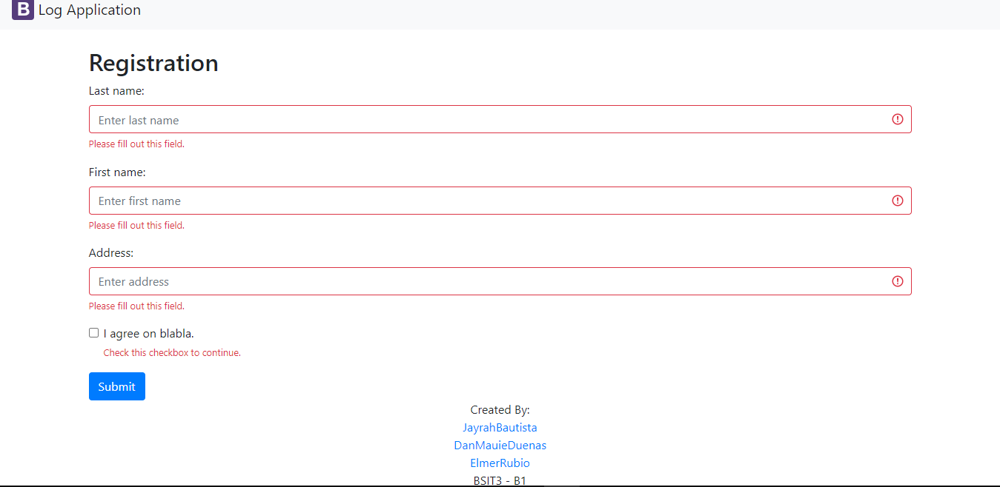
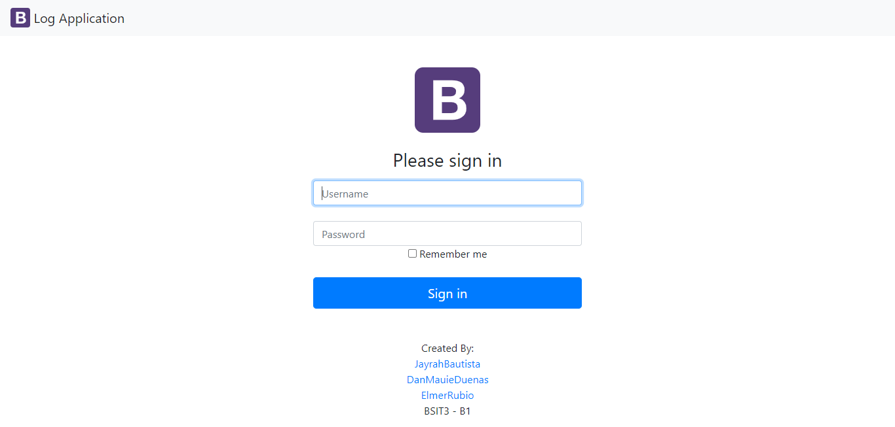
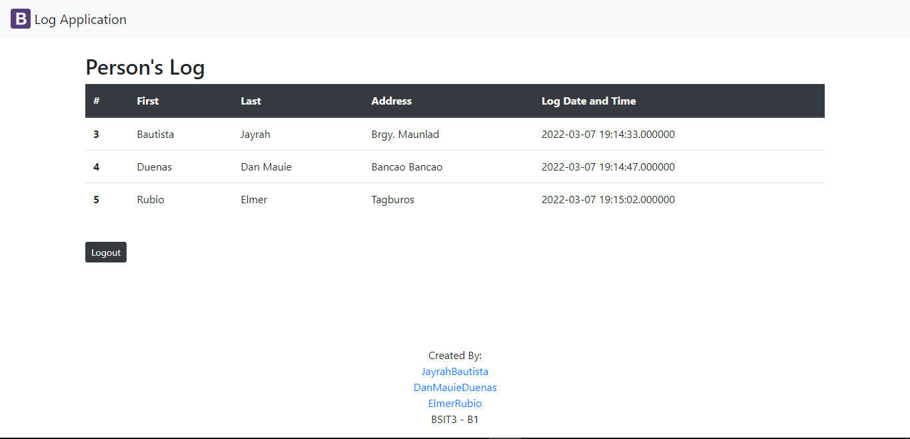

# Table of Contents
1. [Name](#font-colorgree📃inameifont)
2. [Description](#font-colorgree💁idescriptionifont)
3. [Pages of Log App](#font-colorgree👁️‍🗨️ipages-of-log-appifont)
4. [Installation](#font-colorgree🖥️iinstallationifont)
5. [Authors](#🦹font-colorgreeuiauthorsiu)
***

## <font color='gree'>📃<i>Name</i></font>

## Log App
~ is a simple web application created with php and html

***

## <font color='gree'>💁<i>Description</i></font>

~ The logApp has a login feature that only admin can enter in the website and also logout feature. 

~ Registration Form -  User will input their information in the fill up form and submit it by clicking the submit button.

~ Admin only can see the lists of those who fill up and what time they finished to  fill up the form. 

***

## <font color='gree'>👁️‍🗨️<i>Pages of Log App</i></font>

# Registration Form



# Login



# List




***

## <font color='gree'>🖥️<i>Installation</i></font>

HOW TO INSTALL:

STEP 1: Clone the remote repository to your computer using git clone command in cmd.
```
$ git clone [URL of the repository]
```
STEP 2: Move the cloned repository to "C:\XAMPP\htdocs\", if you are using XAMPP, or to "C:\WAMP\www\", if you are using WampServer.

STEP 3: Start XAMPP or WampServer.

STEP 4: Open your browser and go to phpMyAdmin.
```
$ localhost/phpmyadmin
```

STEP 5: Import the database in phpmyadmin of logApp named log_a.sql.

STEP 6: Go to "http://localhost/logApp-scaling-octo/index.php" then you can start to explore it.

<b>FINISH!</b>
***


## 🦹<font color='Gree'><u><i>Authors</i></u>

### 👩‍💻[Jayrah M. Bautista](https://github.com/JayrahBautista)


### 👨‍💻[Dan Mauie Duenas](https://github.com/danmauie)


### 👨‍💻[Elmer O. Rubio Jr.](https://github.com/elmerrubiojr)


***